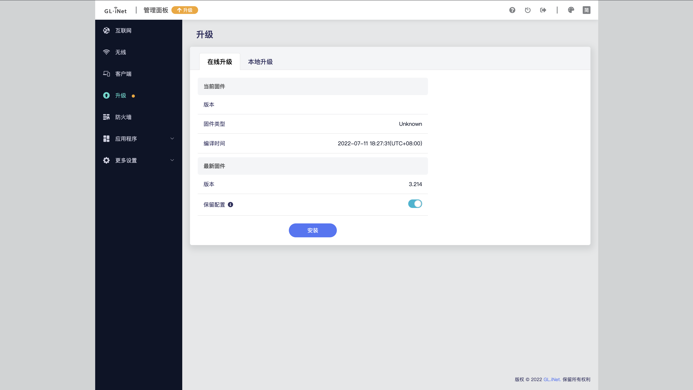
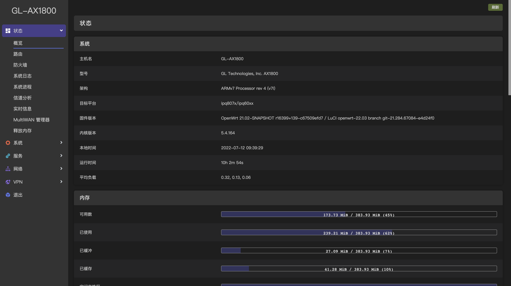
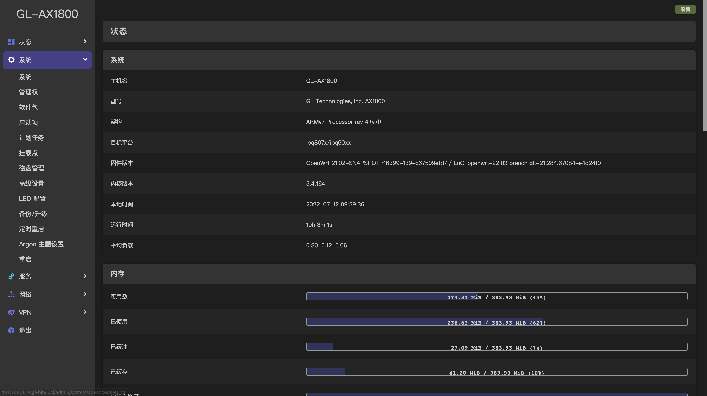
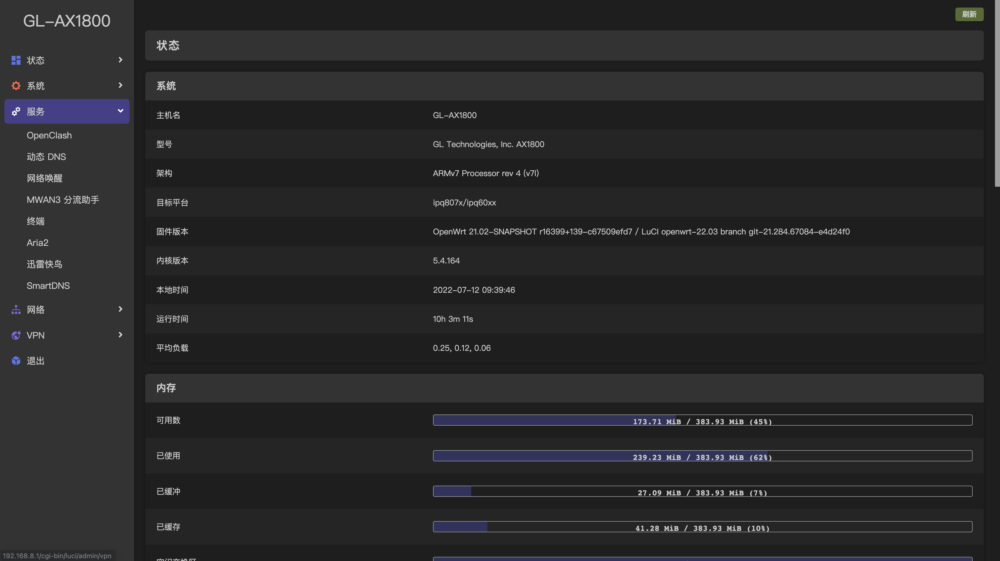
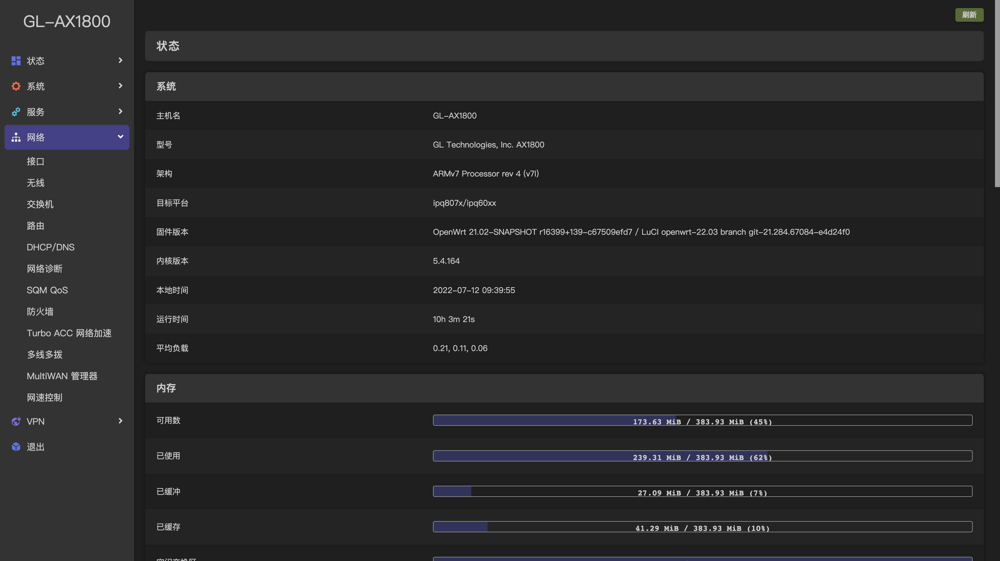
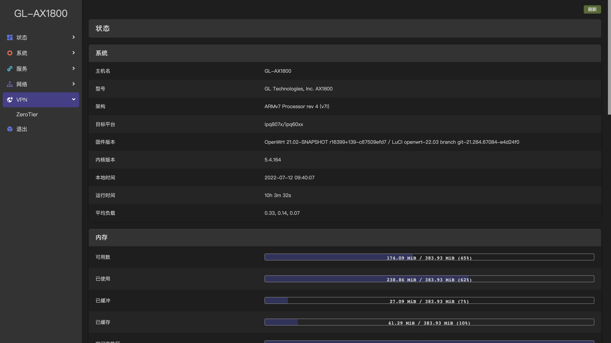

# GL-AX1800 & GL-AXT1800 固件

[](https://github.com/Draco-china/Draco-OpenWrt-GL-AX1800/actions)
[](https://github.com/draco-china/Draco-OpenWrt-GL-AX1800)
[](https://github.com/draco-china/Draco-OpenWrt-GL-AX1800/releases)
[](#界面预览)
[](https://jq.qq.com/?_wv=1027&k=JVYytZpL)

                                        

## 目录介绍

```tree
Draco-OpenWrt-GL-AX1800
├── .github/workflows
│   ├── build-glnet-ax1800.yml    云编译 AX1800
│   ├── build-glnet-axt1800.yml   云编译 AXT1800
│   ├── generate-config.yml       云生成 `glinet-ax1800.yml` & `glinet-ax1800.yml`
├── scripts
│   ├── build.sh                  本地编译脚本，必须在项目根目录下执行 `./scripts/build.sh`
│   ├── feeds.js                  feeds 第三方仓库地址配置
│   ├── generate.js               云生成 `glinet-ax1800.yml` & `glinet-ax1800.yml` 脚本(每天11点定时执行，代码提交也会自动执行)
│   ├── packages.js               packages 第三方软件包配置
│   ├── workflow.tpl              actions 模板文件
│   ├── workflows.js              生成设备所需的设备的工作流（actions）, 支持官方所有支持的型号
├── glinet-ax1800.yml             AX1800 编译描述文件
├── glinet-axt1800.yml            AXT1800 编译描述文件
└── README.md
```

## 其他说明

- *基于官方编译器 <https://github.com/gl-inet/gl-infra-builder> 构建, 支持官方界面*
- *通过  `openwrt-ipq807x-glinet_ax1800-squashfs-sysupgrade.tar` 升级*
- *进入`uboot`，选择 `openwrt-ipq807x-glinet_ax1800-squashfs-nand-factory.img` 文件升级*
- 部分 `feeds` & `packages` 已经注释移除，可自行 `fork` 编译定制
- 北京时间每天 `0:00` 定时检测 `官方更新` `feeds`  `packages` 更新, 如果上游更新将自动重新编译最新固件，`Release` 中只保留最新版本
- **不需要(`定时/监听`)执行的可以将对应的工作流 `schedule/push` 删除或者注释, 编译固件的 `Actions` 请到 `scripts/workflow.tpl` 下修改**
- 历史版本在 `Actions` 中选择一个已经运行完成且成功的 `workflow` 在页面底部可以看到 `Annotations` 和 `Artifacts`
- `Annotations` 中的网盘失效时间一般是 1-3 天, `Artifacts` 需要登录 Github 才能下载
- `Actions` 运行需要设置 `Actions Secrets`, 查看[配置令牌](#配置令牌)

## 配置令牌

- 创建 [Personal access token(PAT)](https://github.com/settings/tokens/new) ，勾选repo权限，这将用于自动触发编译工作流程。
- 
- 然后点击自己仓库的Settings选项卡，再点击Secrets。添加名为 DEPLOY_KEY 的加密环境变量，保存刚刚创建的 PAT 。
- 
- 在 Actions 页面选择 GENERATE CONFIG ，点击Run workflow手动进行一次测试运行。如果没有报错且 OpenWrt 编译工作流程被触发，则代表测试通过。

## 界面预览








## Credits

- [Microsoft Azure](https://azure.microsoft.com)
- [GitHub Actions](https://github.com/features/actions)
- [OpenWrt](https://github.com/openwrt/openwrt)
- [Lean's OpenWrt](https://github.com/coolsnowwolf/lede)
- [tmate](https://github.com/tmate-io/tmate)
- [mxschmitt/action-tmate](https://github.com/mxschmitt/action-tmate)
- [csexton/debugger-action](https://github.com/csexton/debugger-action)
- [Cowtransfer](https://cowtransfer.com)
- [WeTransfer](https://wetransfer.com/)
- [Mikubill/transfer](https://github.com/Mikubill/transfer)
- [softprops/action-gh-release](https://github.com/softprops/action-gh-release)
- [ActionsRML/delete-workflow-runs](https://github.com/ActionsRML/delete-workflow-runs)
- [dev-drprasad/delete-older-releases](https://github.com/dev-drprasad/delete-older-releases)
- [peter-evans/repository-dispatch](https://github.com/peter-evans/repository-dispatch)
- [P3TERX/Actions-OpenWrt](https://github.com/P3TERX/Actions-OpenWrt)
- [gl-inet/gl-infra-builder](https://github.com/gl-inet/gl-infra-builder)
- [JiaY-shi/build-gl](https://github.com/JiaY-shi/build-gl.inet)

## License

[MIT](https://github.com/P3TERX/Actions-OpenWrt/blob/main/LICENSE) © [**P3TERX**](https://p3terx.com)
